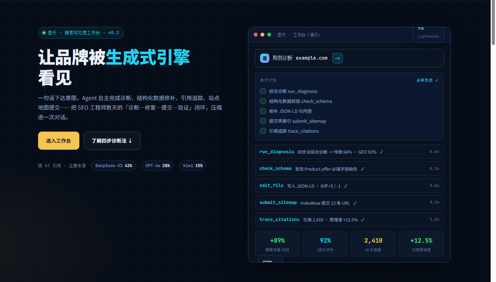

# 壶天 SEO/GEO Agent（hutianSEOGEOAGent）

> 让品牌被生成式引擎看见 —— 一个「会自己干活」的搜索可见度工作台。



一句话下达意图，Agent 自主调用**诊断、结构化数据修补、引用追踪、站点地图提交**等工具，把过去需要 SEO 工程师数天的「诊断—修复—提交—验证」闭环压缩进一次对话，让结果同时被**传统搜索引擎**与**生成式 AI 引擎**（DeepSeek / GPT / Kimi）看见。

## 核心亮点

- **四步诊断法**：技术爬取 / 品牌声誉 / 用户意图 / 性能体验，诊断不是黑盒打分，而是可复述、可执行、可验证的知识资产（`seo-audit` 技能）。
- **MCP 工具链**：5 个基础工具 + 关键词拓词、全站爬取审计、内容差距分析、GSC / GA4 数据接入、内容日历等扩展工具。
- **GEO 生成式优化**：让内容满足生成式引擎的引用条件——实体清晰、结构完整、证据链充分，被 AI 引用并提及。
- **多 LLM 供应商路由**：CodeBuddy / Grok / Kimi / SenseNova / NVIDIA NIM / Gemini，OpenAI 兼容协议统一接入，按优先级自动降级。
- **多端产品形态**：官网 + 工作台 + 桌面版（Wails）+ 移动端 + 多租户 SaaS（admin / tenant-api）。
- **可观测工作台**：工具调用块（running → done）、计划清单逐项点亮、Diff 联动、终端与产物、Auto / Manual 双模式。

## 核心能力

### MCP 工具（hutian-seo-plugin）

| 工具 | 模块 | 说明 |
| --- | --- | --- |
| `run_diagnosis` | tools.py | 四步法综合诊断：传统 SEO / GEO 双评分 + 三项结论 + 问题清单 |
| `check_schema` | tools.py | JSON-LD 结构化数据校验，检测必填字段缺失与富媒体资格 |
| `trace_citations` | tools.py | AI 引用追踪：各引擎占比 / 情感 / 增速 |
| `submit_sitemap` | tools.py | 经 IndexNow 主动提交 URL 再索引，返回提交回执 |
| `entity_rename` | tools.py | 品牌实体更名：dry_run 先行统计，确认后跨全站写盘 + 重写 Schema |
| `keyword_research` | keyword_tools.py | 关键词拓词与话题挖掘 |
| `crawl_site_audit` | crawl_tools.py | 全站爬取审计：站点健康、结构、抓取路径 |
| `analyze_content_gap` | scrape_tools.py | 内容差距分析：对比标杆站点定位内容缺口 |
| `gsc_query` / `gsc_index_status` / `gsc_validate_fix` | gsc_tools.py | Google Search Console：流量查询 / 收录状态 / 修复后验证 |
| `ga4_events` / `ga4_conversions` | ga4_tools.py | GA4 行为事件与转化数据接入 |
| `content_calendar_plan` | content_calendar_tools.py | 内容日历规划与排名趋势存储 |
| CMS 适配 | cms_tools.py / wp_client.py / sitebase_client.py | WordPress / SiteBase 站点内容写入与适配 |

### 技能 / 命令 / 子代理

- **技能**：`seo-audit`（四步法）、`geo-optimize`（实体 / 语义 / 结构化 / 引用四抓手）、`schema-mapping`（业务 → JSON-LD）
- **命令**：`/seo-audit <url>`、`/geo-report <brand>`、`/schema-map <url>`
- **子代理**：`seo-auditor`、`geo-optimizer`（工具白名单隔离，各带角色与优先级规则）
- **钩子**：`PostToolUse` 提示（如 edit_file 后自动提示 check_schema）

## 四步诊断法

1. **技术爬取** — 状态码 / robots.txt / sitemap / 站点结构，确保顺畅抓取。
2. **品牌声誉** — 品牌提及 / 外链质量 / 社交信号，实体可信度。
3. **用户意图** — title / meta / 内容与搜索意图匹配，实体清晰、语义链接完整。
4. **性能体验** — Core Web Vitals、加载与交互响应。

## 演示数据基线

> 来自工作台原型（v0.1 演示基线，用于校准 UI 与 mock；接入真实数据源后以实际为准）。

| 指标 | 基线值 | 说明 |
| --- | --- | --- |
| 传统 SEO 评分 | 64% | 综合诊断 · 传统维度 |
| 生成式 GEO 评分 | 92% | 综合诊断 · 生成式维度 |
| 搜索流量提升 | +89% | 30 日环比 |
| AI 引用量 | 2,410 | 30 日窗口 |
| 引用增速 | +12.5% | 周环比 |
| 主要来源 | DeepSeek-V3 42% · GPT-4o 28% · Kimi 15% | 引用监测 |

## 快速开始

**环境要求**：Node 20+ / pnpm 9+ / Python 3.10+（MCP）/ Git

```bash
git clone https://github.com/esanwu-bot/Echo5.git
cd Echo5/hutian-seo-geo-agent
pnpm install
cp .env.example .env      # 填入 LLM Key（CodeBuddy 默认；可选 Grok / Kimi / SenseNova / NIM / Gemini）
pnpm dev                  # 官网 :3000 + agent-bridge :4317
pnpm dev:mobile           # 移动端开发
```

- 工作台演示：`http://localhost:3000/workbench?mode=mock` —— 零后端自动播放演示时间线。
- 默认 sse 模式：首屏为可输入的空工作台，等待用户输入（避免自动烧钱）。
- 环境自检：`pnpm probe:tenant`（租户 API 探针）。

## 仓库结构

```
Echo5/
├─ hutian-seo-geo-agent/           # 主工作区（turbo monorepo）
│  ├─ apps/
│  │  ├─ web/                      # Next.js 15：官网 SSG + 工作台 CSR
│  │  ├─ agent-bridge/             # 常驻 SSE 桥接服务（心跳 / 重连 / Last-Event-ID）
│  │  ├─ admin/                    # 多租户运营后台
│  │  ├─ tenant-api/               # 多租户 SaaS API
│  │  ├─ desktop/                  # 桌面版（Wails v2：Go + WebView2）
│  │  └─ mobile/                   # 移动端（Capacitor）
│  ├─ packages/agent-protocol/     # 共享 AgentEvent 契约（单一真相源）
│  └─ hutian-seo-plugin/           # MCP 工具 + 技能/命令/子代理/钩子
│     └─ mcp-server/               # Python FastMCP 服务（hutian-seo-mcp）
├─ prototype/                      # 交互原型（工作台 / 后台 / 移动端 HTML）
├─ siteBase/                       # SiteBase 建站底座
├─ wordpress/                      # WordPress 适配
├─ docs/                           # PRD、技术方案、开发计划与工程文档
│  └─ images/hero.png              # 项目展示图
└─ 启动脚本（start_*.bat / start_*.ps1）
```

## 文档导航

| 文档 | 说明 |
| --- | --- |
| `docs/qwen交接.md` | PRD + 技术方案 + 开发计划（需求 ID 贯穿的可追溯文档链） |
| `docs/qwen交接_多租户.md` | 多租户 SaaS 化交接 |
| `docs/自建loop.md` | Agent 自建 loop 方案 |
| `docs/建站多底座方案.md` | 多建站底座（SiteBase / WordPress）方案 |
| `docs/工程纪律.md` / `docs/工作总结.md` | 工程规范与迭代复盘 |
| `docs/ADR-*.md` | 架构决策记录（CMS 适配 / Open API） |
| `docs/项目测试指南.md` | 测试与验收指南 |

## 技术栈与架构

- **Web**：Next.js 15（SSG + CSR）+ Tailwind + turbo monorepo（pnpm）
- **实时链路**：agent-bridge（SSE）→ Next BFF（鉴权代理）→ 前端 EventSource；心跳 ≤ 15s
- **契约**：`packages/agent-protocol` 定义 AgentEvent 类型（工具事件 / Diff / 终端 / 产物 / 指标）
- **能力层**：hutian-seo-plugin（Python FastMCP）+ 技能 / 命令 / 子代理 / 钩子
- **多 LLM**：CodeBuddy（默认）→ Grok → Kimi → SenseNova → NVIDIA NIM → Gemini，OpenAI 兼容协议 + 自动降级到 Mock
- **桌面版**：Wails v2（Go 主进程 + WebView2），本地优先，与 SaaS 共享前端
- **移动端**：Capacitor；**多租户**：tenant-api + admin + BFF 鉴权

## 版本规划

| 版本 | 主题 | 能力 |
| --- | --- | --- |
| v0.1 | 看得见 | 官网 + 工作台 UI + mock 时间线全链路 + 主题 |
| v0.2 | 干得了（本地） | MCP 五工具本地可跑 + 技能/命令/子代理 + bridge 演示流 |
| v0.3 | 自建 loop | agent-bridge 自建 loop，CodeBuddyClient 调 LLM |
| v1.x | 接得真 | GSC / GA4 / 关键词 / 爬取审计 / 内容差距 / 内容日历 + 多租户 SaaS / 桌面 / 移动 |

## License

MIT License © 2026 esanwu-bot

## 联系方式

- 手机 / 微信：**18688361467**
- 邮箱：**352576216@qq.com** · **esan.wu@gmail.com**
